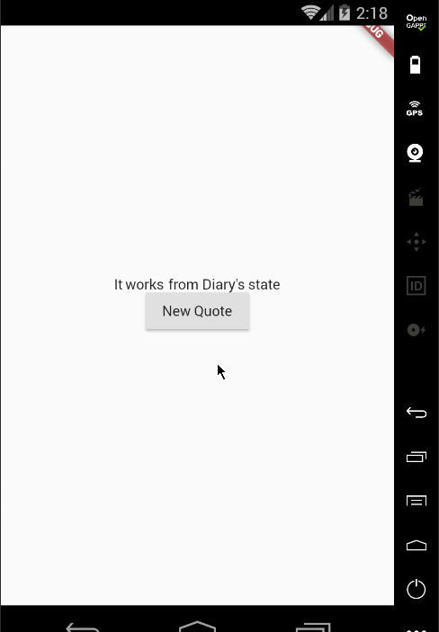

Uma das coisas mais difíceis no desenvolvimento - IMHO - depois de nomear, é lidar com estado, pelo menos lidar com ele de forma reativa sem excessos (over-building, over-rendering, over-painting e overhead!).

### Vamos começar!

Sem segredo:

```
flutter create geo_tag_diary
```

Abra no seu editor favorito. Eu pessoalmente gosto do VSCode, então code geo\_tag\_diary, depois adicione flutter\_redurx na chave dependencies do pubspec.yaml. Deixe seu editor buscar as dependências de novo ou rode, na pasta do projeto: flutter packages get.

```
dependencies:
  flutter_redurx:
  flutter:
    sdk: flutter
```

Agora vamos criar um app bem básico só para vê-lo funcionando no device/emulator/simulator (você escolhe o nome).

Crie um arquivo lib/app.dart e adicione o conteúdo:

<a href="https://medium.com/media/1bf812c62600169ed1da9298d6702138/href">https://medium.com/media/1bf812c62600169ed1da9298d6702138/href</a>

E substitua tudo em lib/main.dart por:

<a href="https://medium.com/media/63287de8590c60d120a70e5c383fe3f6/href">https://medium.com/media/63287de8590c60d120a70e5c383fe3f6/href</a>

Rode o app; você deve estar vendo It works no centro da tela. E você sabe o que isso significa: significa que **nosso greenfield está funcionando!**

### Adicionando Flutter-ReduRx

Vamos mudar um pouco para ver um pouco da mágica do Flutter-ReduRx acontecendo.

Primeiro, criamos a classe que vai representar nosso estado. Vou chamá-la de Diary e colocá-la em lib/diary.dart:

<a href="https://medium.com/media/c63e663d38c683d481a0d1a27ba7b8e3/href">https://medium.com/media/c63e663d38c683d481a0d1a27ba7b8e3/href</a>

Então alteramos lib/main.dart para criar o estado inicial, entregá-lo a uma Store e entregar a Store a um Provider:

<a href="https://medium.com/media/9ef4ddcb333cb22ca70cde3b6650f2e1/href">https://medium.com/media/9ef4ddcb333cb22ca70cde3b6650f2e1/href</a>

Flutter-ReduRx é uma camada de integração entre os bindings do Flutter (Provider & Connect) e o gerenciamento de estado do [ReduRx](https://github.com/leocavalcante/ReduRx) (por meio de Store & Action).

Vamos ver o que esse Connect significa no novo lib/app.dart. **Por favor, leia os comentários no código:**

<a href="https://medium.com/media/c1510dcf39e1dda52b05abac3ef9567a/href">https://medium.com/media/c1510dcf39e1dda52b05abac3ef9567a/href</a>

> Certo, mas tudo isso poderia ser substituído pela nova mensagem na versão greenfield...

Vamos ver **o porquê** agora!

### Mutando o estado com Actions

Actions são o último conceito aqui e vão fechar o modelo Flux.

Vamos criar uma Action que muta nosso estado inicial anterior para uma nova mensagem. Em lib/actions.dart:

<a href="https://medium.com/media/3e4aa7a8108ed4405b2ded981ee2cbb3/href">https://medium.com/media/3e4aa7a8108ed4405b2ded981ee2cbb3/href</a>

Para fazer **dispatch** dessas Actions, podemos chamar o método dispatch na Store. Preste atenção aos comentários de novo, por favor.

E note que mudamos lib/app.dart para lidar com mais componentes em uma Column.

<a href="https://medium.com/media/dd7155b7979e9cb53629bce2e0cb0edb/href">https://medium.com/media/dd7155b7979e9cb53629bce2e0cb0edb/href</a>

> Muito legal! Mas a vida não é feita de constantes hard-coded. A gente conversa com bancos de dados, outros aplicativos e serviços em geral...

### Aí vêm as AsyncActions

Assim como Actions, mas com o poder das construções Async do Dart.

Vamos melhorar nosso Diary com frases aleatórias legais para deixar seu dia melhor. Vou usar a API do [Tadas Talaikis](https://medium.com/u/58ac2a3f4f56) (sem um bom motivo, só pesquisei no Google por “free quote api”) e a abstração HTTP do [pacote http](https://pub.dartlang.org/packages/http). O lib/actions.dart deve ficar assim:

<a href="https://medium.com/media/728af8b3676bebffba9b15f3556bc202/href">https://medium.com/media/728af8b3676bebffba9b15f3556bc202/href</a>

Devemos atualizar lib/app.dart para chamar nossa AsyncAction recém-criada. Como sempre, por favor continue a leitura dando uma olhada nos comentários no código:

<a href="https://medium.com/media/ec613b36f6cb0295c4a9e9bfa47944ca/href">https://medium.com/media/ec613b36f6cb0295c4a9e9bfa47944ca/href</a>

### O resultado

[https://github.com/leocavalcante/Flutter-ReduRx-GeoTagDiary/tree/part-1](https://github.com/leocavalcante/Flutter-ReduRx-GeoTagDiary/tree/part-1)



Por que isso se chama “GeoTagDiary” e existe uma “part 1”? Porque uma única String é fácil; tem mais vindo por aí! Fique ligado!

Obrigado!

A [**Flutter Pub**](https://medium.com/FlutterPub) é uma publicação do Medium para trazer os recursos mais recentes e incríveis, como artigos, vídeos, códigos, podcasts etc. sobre essa ótima tecnologia, para ensinar você a construir apps bonitos com ela. Você pode nos encontrar no [Facebook](https://www.facebook.com/FlutterPub), [Twitter](https://twitter.com/FlutterPub) e [Medium](https://medium.com/flutterpub), ou saber mais sobre nós [aqui](https://medium.com/flutterpub/welcome-to-flutter-pub-8480678ed212). Adoraríamos nos conectar! E, se você é uma pessoa interessada em escrever para nós, pode fazer isso [por meio destas diretrizes](https://medium.com/flutterpub/how-to-submit-your-article-s-on-flutterpub-7b6bf37dfc43).


