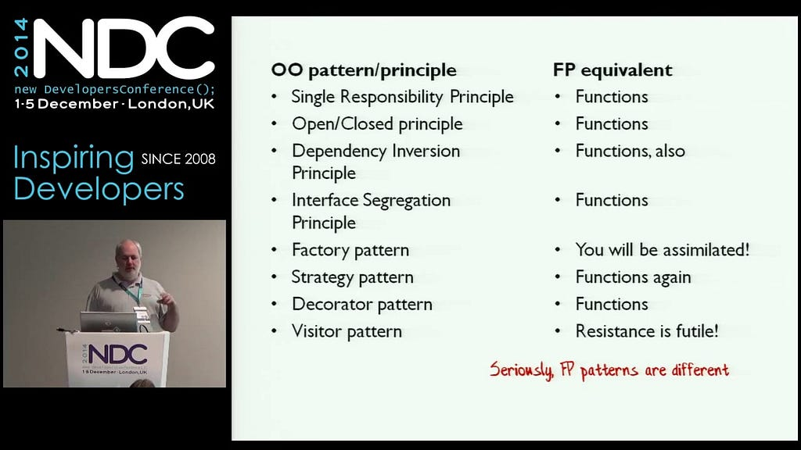
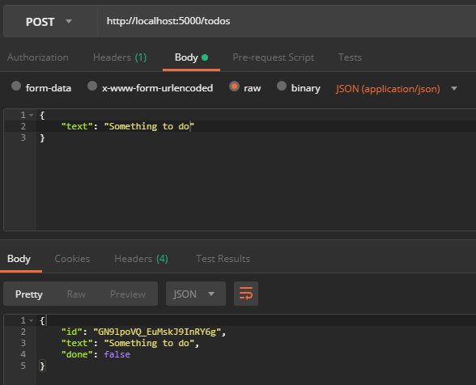

Tenho apenas alguns anos em programação funcional, apenas algumas semanas em F# e nenhuma base ou experiência com .NET, então não tome isto como referência de especialista; sou apenas eu documentando o que aprendi até agora.

Você pode começar construindo um servidor HTTP bem cru, vanilla e bare-bones usando o [HttpListener do .NET](https://docs.microsoft.com/en-us/dotnet/framework/network-programming/httplistener), **mas ele é muito baixo nível** em termos de abstrações; por exemplo: você precisa escrever em buffers de stream para gerar alguma saída.

Existe o [ASP.NET Core](https://docs.microsoft.com/en-us/aspnet/core/?view=aspnetcore-2.1), **mas ele é muito orientado a objetos**, suas construções não são funcionais e, ei, estamos usando F# por um motivo, certo?

[Freya](https://freya.io/) parece ser um caminho de alto nível e puramente funcional incrível, **mas tem poucos mantenedores e está há meses sem atualizações**.

### Apresentando o Giraffe

Então existe o [Giraffe](https://github.com/giraffe-fsharp/Giraffe), o sobrevivente dos meus critérios enviesados acima. Ele é **alto nível, functional-first e mantido ativamente!**

Você pode começar usando seu template dotnet-new, mas eu gosto de greenfield, então vamos começar do zero:

```
λ mkdir Todos
λ cd Todos
λ dotnet new console -lang F#
```

Vamos começar usando o template _console_; é o mais simples que encontrei e vai criar apenas um arquivo **.fsproj** mínimo. Você pode executá-lo para garantir que está tudo certo:

```
λ dotnet run
Hello World from F#!
```

Vamos adicionar nossas dependências. O Giraffe roda sobre o ASP.NET Core e vamos usar o driver MongoDB de C#, mas não se preocupe, [ele também é ótimo para F#](https://www.mongodb.com/blog/post/enhancing-the-f-developer-experience-with-mongodb).

```
λ dotnet add package Microsoft.AspNetCore.App
λ dotnet add package Giraffe
λ dotnet add package MongoDB.Driver
```

Todas elas vêm do [NuGet](https://www.nuget.org/).

Vamos alterar nosso Hello World para responder a uma Request:

<a href="https://medium.com/media/e6a59730ffedd833766403662e26b48a/href">https://medium.com/media/e6a59730ffedd833766403662e26b48a/href</a>

Para iniciar nosso servidor de desenvolvimento:

```
λ dotnet run
```

Você verá uma mensagem dizendo que ele está rodando em [http://localhost:5000](http://localhost:5000). Acesse essa URL no seu navegador favorito e você deverá ver: Hello World from F#!

**Temos um servidor rodando!** E agora?

#### Vamos manter isto simples

Todos têm um texto dizendo o que deve ser feito e uma flag booleana indicando se já foram concluídos, além de um identificador único, claro:

<a href="https://medium.com/media/1339f5ea09bdbf38a364793aa97cabda/href">https://medium.com/media/1339f5ea09bdbf38a364793aa97cabda/href</a>

#### Estruturando nossos endpoints CRUD

Além de servir textos “Hello World”, claro, o Giraffe pode delegar endpoints HTTP para [handlers](https://github.com/giraffe-fsharp/Giraffe/blob/master/DOCUMENTATION.md) de função definidos como HttpFunc -> HttpContext -> HttpFuncResult:

<a href="https://medium.com/media/c145fc38df06d4a6319379652e141522/href">https://medium.com/media/c145fc38df06d4a6319379652e141522/href</a>

Também precisamos atualizar nosso Program.fs para incluir esses handlers em nossas rotas:

<a href="https://medium.com/media/d056bbc1cf929e59ac1cb180a3bfa545/href">https://medium.com/media/d056bbc1cf929e59ac1cb180a3bfa545/href</a>

Inicie o servidor com dotnet run e teste!


#### Todos em memória

Antes de colocar as mãos no MongoDB, podemos fazer uma prova de conceito usando uma representação em memória bem simples do que seria um repositório de Todo e de como operar nossas funções CRUD sobre ele.

Além disso, é uma forma de garantir que nosso domínio não esteja preso demais a nenhum fornecedor de banco de dados. Poderíamos substituir o MongoDB por qualquer outro tipo de armazenamento apenas reimplementando as assinaturas das funções para o novo banco.

Amplie o Todo.fs com os seguintes tipos:

<a href="https://medium.com/media/42773368c07c9ffafaa9ddd88cc06c2c/href">https://medium.com/media/42773368c07c9ffafaa9ddd88cc06c2c/href</a>

Isso não faz muita coisa, mas pense nisso como interfaces de OO. O ponto importante aqui é que não vamos reinventar a roda; em vez disso, vamos usar as ótimas [construções de Dependency Injection que o ASP.NET Core já oferece](https://docs.microsoft.com/en-us/aspnet/core/fundamentals/dependency-injection?view=aspnetcore-2.1).

Por exemplo, nosso endpoint HTTP GET ficará assim:

<a href="https://medium.com/media/8976e68359a0ad47ff35dc4cc9525915/href">https://medium.com/media/8976e68359a0ad47ff35dc4cc9525915/href</a>

Estamos dependendo da “interface” TodoFind e, para o endpoint, a implementação não importa. Ela pode ser em memória, MongoDB ou qualquer outra; ele só sabe que recebe um TodoCriteria e retorna um Todo\[\] (que então o Giraffe transforma automaticamente em JSON através da função thejson).

**Sim, estamos fazendo Dependency Inversion com funções!**



Functional Programming Design Patterns, de Scott Wlaschin

Vamos implementar as partes C e R do CRUD em memória com a ajuda de uma Hashtable:

<a href="https://medium.com/media/6dadd91e032a29e7c7848cc40a524f75/href">https://medium.com/media/6dadd91e032a29e7c7848cc40a524f75/href</a>

Você provavelmente percebeu que find aqui é um pouco diferente de TodoFind: ele é Hashtable -> TodoCriteria -> Todo\[\]. Isso acontece porque precisamos compartilhar a mesma Hashtable com outras funções, mas não se preocupe: graças a Currying, podemos passar uma Hashtable para find e ele retorna um TodoFind perfeitamente válido. Podemos injetá-lo como Singleton através de configureServices:

<a href="https://medium.com/media/3e521b7fa8f6e38cbcf27a8070c15cc9/href">https://medium.com/media/3e521b7fa8f6e38cbcf27a8070c15cc9/href</a>

Você entendeu, certo? Estamos definindo nosso TodoFind com a função find **“hashtabled”** de TodoInMemory. Vamos implementar o TodoSave:

<a href="https://medium.com/media/49bc96ab52619921db12c2b7ee9800ef/href">https://medium.com/media/49bc96ab52619921db12c2b7ee9800ef/href</a>

Então vamos injetá-lo em nossos serviços, mas não esqueça que precisamos compartilhar a Hashtable, para buscarmos e salvarmos no mesmo lugar em memória:

<a href="https://medium.com/media/8096ebb7e019a0cb295ab9dd38ebf1b5/href">https://medium.com/media/8096ebb7e019a0cb295ab9dd38ebf1b5/href</a>

Podemos melhorar as coisas aqui. Note que IServiceCollection ganhou um método AddGiraffe? Não, o Giraffe não é embutido no .NET; ele usou o poder das [Type Extensions](https://docs.microsoft.com/en-us/dotnet/fsharp/language-reference/type-extensions), e podemos fazer isso também para TodoInMemory:

<a href="https://medium.com/media/acbf15c323788a4ff9ad7101fe78c7b8/href">https://medium.com/media/acbf15c323788a4ff9ad7101fe78c7b8/href</a>

Não estamos evitando uma chamada a AddSingleton para cada assinatura de função, mas pelo menos isso fica bem colocado no mesmo módulo, muito claro e fácil de entender. Podemos usar AddTodoInMemory assim como AddGiraffe:

<a href="https://medium.com/media/5e2383b863f86f48447de6eb89eac402/href">https://medium.com/media/5e2383b863f86f48447de6eb89eac402/href</a>

Agora devemos atualizar TodoHttp para recuperar e chamar nossas funções. Já vimos como o GET fica; aqui está o arquivo completo com a modificação do POST:

<a href="https://medium.com/media/1dacf69e886a9bb717aa1e989896771e/href">https://medium.com/media/1dacf69e886a9bb717aa1e989896771e/href</a>

**Já conseguimos salvar e buscar alguns Todos!**




Lembre-se: está tudo em memória naquela Hashtable mutável. Se reiniciarmos o servidor, tudo desaparece.

### Implementando MongoDB!

Primeiro, nosso tipo final TodoDelete para Delete; vamos usar TodoSave para Create e Update:

<a href="https://medium.com/media/5c823761845dabbc6f93618379482ae9/href">https://medium.com/media/5c823761845dabbc6f93618379482ae9/href</a>

Não há muita diferença em relação à versão em memória. Vamos substituir a Hashtable por uma IMongoCollection, refatorar nosso save para saber quando inserir ou atualizar e também implementar TodoDelete:

<a href="https://medium.com/media/c51dd438bd7181f8a3aec8f9f5afe793/href">https://medium.com/media/c51dd438bd7181f8a3aec8f9f5afe793/href</a>

E, como esperado, TodoHttp não tem mudanças para Create e Read; vamos apenas implementar Update e Delete:

<a href="https://medium.com/media/225ae8cf65ed20cc6cd38225338c596a/href">https://medium.com/media/225ae8cf65ed20cc6cd38225338c596a/href</a>

E substituímos os serviços, de AddTodoInMemory para AddTodoMongoDb. Claro, vamos precisar de uma conexão de cliente MongoDB e de um banco de dados MongoDB:

<a href="https://medium.com/media/77d49aaa247cb4b0c669a3ddfabc2ab1/href">https://medium.com/media/77d49aaa247cb4b0c669a3ddfabc2ab1/href</a>

Estou assumindo que você tem um servidor MongoDB rodando em algum lugar e que vamos obter a string de conexão pelas variáveis de ambiente. Então, antes de executar dotnet run, garanta que você tenha essas variáveis ou defina/exporte uma. No meu caso, tenho o MongoDB no localhost, então: export MONGO\_URL=mongodb://localhost:27017/.

**É isso!** Temos uma API HTTP REST desacoplada e functional-first com F# e MongoDB. Como disse antes, sou novo em tudo isso, então adoraria receber feedback de pessoas experientes e, se isso também for novo para você, fique à vontade para comentar suas perguntas; vamos descobrir juntos.

#### Obrigado!
