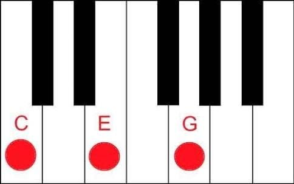
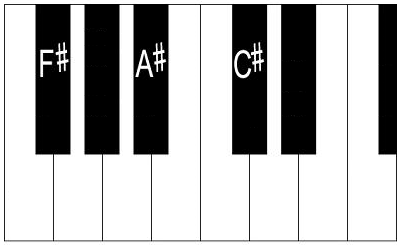

When I’m not in front of a “soup of colored letters” (people say this when they see my screen on VS Code) or “jumpy green text” (yeah, this one is for the terminal); I like to play and study music! Diving into my journey on F#, this is my attempt to mix this new and old passions.

#### Some basic music context

As you maybe already know, music has a lot of ways to get things done, harmonic fields, chord progression, scales and much more. But let’s keep this simple, everybody knows about a least one scale, the Major scale:

<a href="https://medium.com/media/76b2839cb71b2a56dc2f609904087fb9/href">https://medium.com/media/76b2839cb71b2a56dc2f609904087fb9/href</a>

This one in particular is the C Major scale: **C D E F G A B C**. It’s a common scale because doesn’t any accidentals: **flats (♭)** or **sharps (♯)**. A good way to see this is by making a reference to the white keys and black keys of a piano keyboard:


12 notes for the full [Chromatic scale](https://en.wikipedia.org/wiki/Chromatic_scale). That is when F# the language and the note get mixed. Same for C#.

### Talk is cheap. Show me the code

Love this Linus quote. Let’s model our domain, first the notes:

<a href="https://medium.com/media/f0e914fc9280cce00f465c3dd78203c3/href">https://medium.com/media/f0e914fc9280cce00f465c3dd78203c3/href</a>

Each interval of a note is called a **Semitone** (half step or a half tone) is the smallest commonly used musical interval. We can make our notes interact with each other by modeling the following pattern:

<a href="https://medium.com/media/499d9ff28024a185995c92e001997993/href">https://medium.com/media/499d9ff28024a185995c92e001997993/href</a>

Easy, right? When a C is given, pitching half a tone up is Db or C#. Pitch here is just: note -> note.

As you imagined, you can model a **whole tone** by pitching up two semitones:

<a href="https://medium.com/media/880a9780d279b671f5391ebe308e5e59/href">https://medium.com/media/880a9780d279b671f5391ebe308e5e59/href</a>

We’re ready to model our first scale, a Major scale. The Major scale is a Diatonic scale, this basically means that is compound by 5 tones and 2 semitones. On the Major scale they are distributed in the following order:

Tone — Tone — Semitone — Tone — Tone — Tone — Semitone

That is why the C Major scale is C D E F G A B C, because from C to D is a Tone, from D to E is a Tone from E to F is a Semitone, from F to G is a Tone and so on…

**How can we model this on F# (the language)?**

<a href="https://medium.com/media/df5e77c4e9b904a4b6da733b38f3fdbc/href">https://medium.com/media/df5e77c4e9b904a4b6da733b38f3fdbc/href</a>

Here comes a Functional Programming exercise, how we can build Notes given our Pitches and the Major scale?

We can fold the Major list by applying the current Pitch on the last note of the Scale, given a Initial note that is our [**Tonic**](https://en.wikipedia.org/wiki/Tonic_(music)):

<a href="https://medium.com/media/b6ae6a9858569fef9726f136d25b7cd4/href">https://medium.com/media/b6ae6a9858569fef9726f136d25b7cd4/href</a>

```
λ dotnet run
[C; D; E; F; G; A; B; C]
```

Let’s try another Tonic, one with accidents (♭/♯), what about the **F# (the note) Major Scale?** [https://en.wikipedia.org/wiki/F-sharp\_major](https://en.wikipedia.org/wiki/F-sharp_major) (F♯, G♯, A♯, B, C♯, D♯, and E♯). This can be a bit confusing, but remember: F# is Gb, G# is Ab etc. [Also E# is Enharmonic to F](https://en.wikipedia.org/wiki/F_(musical_note)#E_sharp). Here is the full Program.fs:

<a href="https://medium.com/media/22ac05b351ed3b2cf40ee16bd4f301d7/href">https://medium.com/media/22ac05b351ed3b2cf40ee16bd4f301d7/href</a>

```
λ dotnet run
[Gb; Ab; Bb; B; Db; Eb; F; Gb]
```

### Adding More Music Context

Each note on the scale has it’s own meaning and play different roles on harmonization. As the first note is the Tonic, the second one is the Supertonic, third is [Mediant](https://en.wikipedia.org/wiki/Mediant) and so on… They are often represented as Roman numerals:

<a href="https://medium.com/media/f3b93d503190ba2c6a5fa02b464decdb/href">https://medium.com/media/f3b93d503190ba2c6a5fa02b464decdb/href</a>

We should now augment our build function to bring this new semantic to our scale:

<a href="https://medium.com/media/b15827ed3980c4e989443b39ed5d3853/href">https://medium.com/media/b15827ed3980c4e989443b39ed5d3853/href</a>

For simplicity, we’re back to our classic C Major scale, but now with Triad context:

```
λ dotnet run
[I C; II D; III E; IV F; V G; VI A; VII B; I C]
```

### Chords!

A Chord is when 3 or more notes are played simultaneously.

<a href="https://medium.com/media/cb87f7e00cbc57031cd6b6052953678d/href">https://medium.com/media/cb87f7e00cbc57031cd6b6052953678d/href</a>

They are not randomly selected, to sound nice, the Major chord is formed by picking some degrees on the Major scale, they are:

I — Tonic

III — Mediant

V — Dominant

<a href="https://medium.com/media/3c3366cf736cdd4e4f9a252e432270f4/href">https://medium.com/media/3c3366cf736cdd4e4f9a252e432270f4/href</a>

So the C Major Chord is formed by: **C** _D_ **E** _F_ **G** _A B_



Let’s check:

<a href="https://medium.com/media/4afd92252101054938fd99a6e6362ff3/href">https://medium.com/media/4afd92252101054938fd99a6e6362ff3/href</a>

```
λ dotnet run
[I C; II D; III E; IV F; V G; VI A; VII B; I C]
[C; E; G]
```

Yeah, you wanna know the **F# (note)** chord, right? Let’s use **F# (lang)**:

<a href="https://medium.com/media/f811859fc83007f9d4c05cf15056c93d/href">https://medium.com/media/f811859fc83007f9d4c05cf15056c93d/href</a>

```
λ dotnet run
[I Gb; II Ab; III Bb; IV B; V Db; VI Eb; VII F; I Gb]
[Gb; Bb; Db]
```



Remember: F# = Gb; A# = Bb; C# = Db.

That is all the fun for now. You can follow the work-in-progress here: [https://github.com/leocavalcante/Fusic](https://github.com/leocavalcante/Fusic)

Thanks!
