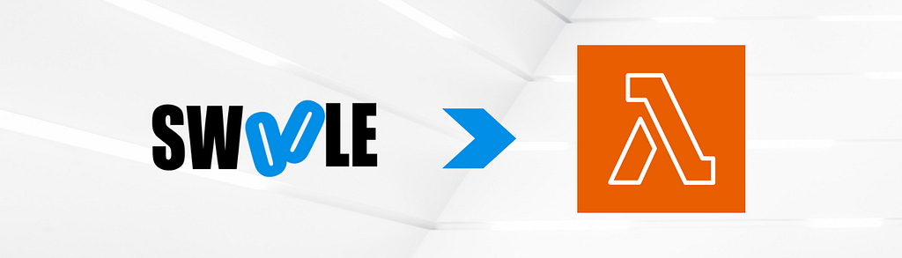

[Swoole](https://github.com/swoole/swoole-src) is about to deliver something very, very cool: its own CLI. You can already start using it with the precompiled binary distributed in Swoole releases at [https://github.com/swoole/swoole-src/releases/tag/v4.8.7](https://github.com/swoole/swoole-src/releases/tag/v4.8.7).

The trick here, for this project, is that we will ship the Swoole CLI binary together with [Bref](https://bref.sh/)'s LambdaRuntime to provide a [Custom AWS Runtime](https://docs.aws.amazon.com/lambda/latest/dg/runtimes-custom.html) that supports Swoole.

**Shall we start?**

Create a directory to store our files:

```
mkdir swoole-lambda
cd swoole-lambda
```

Bring in the IDE Helper so we have Swoole _autocomplete_ in our editor:

```
composer require --dev swoole/ide-helper
```

Then we can bring in [Bref](https://bref.sh/):

```
composer require bref/bref
```

[Bref](https://bref.sh/) will provide the abstraction for communicating with the AWS Lambda _runtime_. We can simply call it in our bootstrap file. The bootstrap file is where the Lambda _runtime_ will start execution:

```
#!/opt/bin/swoole-cli
<?php

use Bref\Context\Context;
use Bref\Runtime\LambdaRuntime;
use Swoole\Coroutine;

require_once __DIR__ . '/vendor/autoload.php';

$runtime = LambdaRuntime::fromEnvironmentVariable('swoole-cli');
$handler = require $_ENV['LAMBDA_TASK_ROOT'] . '/handler.php';

Coroutine\run(static function () use ($runtime, $handler): void {
    while (true) {
        $runtime->processNextEvent($handler);
    }
});
```

AWS Lambda will move whatever is in our bin/ directory to /opt/bin, so the Swoole CLI binary will be there. That is why we can create our PHP Bootstrap application as a self-executing script that will use an interpreter located at that path.

Let's download it:

```
wget https://github.com/swoole/swoole-src/releases/download/v4.8.7/swoole-cli-v4.8.7-linux-x64.tar.xz
tar -xf swoole-cli-v4.8.7-linux-x64.tar.xz
mkdir bin
mv swoole-cli bin/
rm swoole-cli-v4.8.7-linux-x64.tar.xz
```

#### **UPX to the rescue!**

A 148 MB binary file can be too large for a function. Let's use UPX to make it smaller:

```
upx -9 bin/swoole-cli
```

The -9 tells UPX to make it as small as possible. This may take a while, but the **final result is a 44 MB binary, about 30% of the original file size!**

Now we can safely create our _runtime_ ZIP file:

```
zip -r runtime.zip bootstrap bin
```

And upload it to AWS Lambda as a _layer_:

```
aws lambda publish-layer-version \
--layer-name swoole-runtime \
--zip-file fileb://runtime.zip \
--region us-east-1
```

Now let's do the same thing with our _vendor/_ files:

```
zip -r vendor.zip vendor
```

And upload it as a _layer_ too:

```
aws lambda publish-layer-version \
--layer-name swoole-lambda-vendor \
--zip-file fileb://vendor.zip \
--region us-east-1
```

With the _layers_ uploaded, we are ready to create our function.

The handler.php file that the bootstrap requires contains our function code:

```
<?php

declare(strict_types=1);

use Bref\Context\Context;

return static fn ($event, Context $context): string =>
    'Hello ' . ($event['name'] ?? 'world');
```

Now let's _zip_ it:

```
zip -r function.zip handler.php
```

And create it in AWS:

```
aws lambda create-function \
--function-name swoole-lambda \
--handler handler.handler \
--zip-file fileb://function.zip \
--runtime provided \
--role arn:aws:iam::884320951759:role/swoole-lambda \
--region us-east-1 \
--layers arn:aws:lambda:us-east-1:884320951759:layer:swoole-runtime:1 \
arn:aws:lambda:us-east-1:884320951759:layer:swoole-lambda-vendor:1
```

**Ok, drum roll!**

Let's test it:

```
aws lambda invoke \
--function-name swoole-lambda \
--region us-east-1 \
--log-type Tail \
--query 'LogResult' \
--output text \
--payload $(echo '{"name": "Swoole"}' | base64) output.txt | base64 --decode
```

The output should look something like:

```
START RequestId: eaa39e02-b833-4f06-b18d-7e9a5b603a97 Version: $LATEST
END RequestId: eaa39e02-b833-4f06-b18d-7e9a5b603a97
REPORT RequestId: eaa39e02-b833-4f06-b18d-7e9a5b603a97  Duration: 3.67 ms       Billed Duration: 4 ms   Memory Size: 128 MB     Max Memory Used: 115 MB
```

Let's see the result:

```
cat output.txt
"Hello Swoole"
```

**That's all folks!**

[Bref](https://bref.sh/) abstracts all the work of communicating with the AWS Lambda _runtime_ interface. Internally it uses curl\_\* [**which Swoole can hook into and run asynchronously!**](https://github.com/swoole/swoole-src)

And of course, it goes without saying, the Swoole CLI project also rocks by bringing us a PHP interpreter with Swoole built in (statically compiled).
