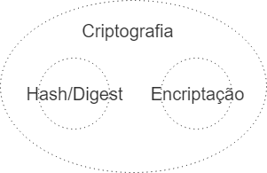

É comum as pessoas defenderem que hash não é criptografia; fazem isso veemente a ponto de ridicularizar quando leem algo como “Fiz criptografia com MD5”. É tão errado assim falar isso?

Você já viu algum artigo em inglês comentando algo do tipo? Algo como “Hash is not Cryptography”? Agora pesquisa por “Hash não é Criptografia”. Interessante, não é? Parece que é uma constatação apenas brasileira.

Essa observação me fez levantar a hipótese de que a culpa é da tradução. Poucas pessoas usam a palavra ‘encriptação’ e por isso muito material traduz ‘encryption’ como ‘criptografia’, na boa intenção de deixar o texto mais digerível, só que acaba fazendo essa confusão.

> In cryptography, encryption is the process of encoding a message or information in such a way that only authorized parties can access it. — [https://en.wikipedia.org/wiki/Encryption](https://en.wikipedia.org/wiki/Encryption)

Encriptação sim é o processo de converter uma mensagem pra algo inelegível, mas de uma forma que esse processo possa ser revertido em outra ponta numa… _decriptação_. Mas isso não é tudo o que a criptografia faz. Pelo menos não de umas décadas pra cá:

> Before the modern era, cryptography focused on message confidentiality (i.e., encryption) — conversion of messages from a comprehensible form into an incomprehensible one and back again at the other end \[…\] **In recent decades**, the field has **expanded** **beyond confidentiality** concerns to include techniques for message integrity checking, sender/receiver identity authentication, **digital signatures**, interactive proofs and secure computation, among others. — [https://en.wikipedia.org/wiki/Cryptography#History\_of\_cryptography\_and\_cryptanalysis](https://en.wikipedia.org/wiki/Cryptography)

### Criptografia é maior que tudo isso

A criptografia evoluiu pra além de confidencialidade e hoje a encriptação é “apenas” um parte disso. A literatura em inglês não faz nenhuma distinção hierárquica sobre **Hash** e **Encriptação**, é como se eles fossem dois irmãos filhos do pai Criptografia, não é como se Hash fosse um parente distante que nem consideram da família.

> Cryptographic hash functions play a fundamental role in modern cryptography — Handbook of Applied Cryptography

> Hash functions are used in many parts of cryptography — Introduction to Modern Cryptography

> Hash functions are an important cryptographic primitive and are widely used in
>
> protocols — Understanding Cryptography, A Textbook for Students and Practitioners

Todos os livros citados acima (e muitos mais outros) tem capítulos inteiros dedicados a Hash. **Porque Hash é uma forma de Criptografia, o que Hash não é, é uma forma de Encriptação.**

> Hashing is a common technique used in cryptography to encode information quickly using typical algorithms. — [https://en.wikipedia.org/wiki/History\_of\_cryptography#Hashing](https://en.wikipedia.org/wiki/History_of_cryptography)

> Hash functions used in cryptography have the property that it is easy to calculate the hash, but difficult or impossible to re-generate the original input if only the hash value is known. — [https://www.owasp.org/index.php/Guide\_to\_Cryptography#Hashes](https://www.owasp.org/index.php/Guide_to_Cryptography)

Hash e Encriptação são ambos Criptografia assim como Trapézio e Quadrado são Quadriláteros. _Analogia boa?_

A diferença entre Hash e Encriptação é que é um _one-way_ e outro é _two-way_, (respectivamente) uma ‘só vai’ e a outra ‘vai e volta’, ou seja, a ideia da **Criptografia por Hash** é que seja impossível saber o valor original sabendo só o valor que a Hash Function gerou. E a **Criptografia por Encriptação** é que seja possível descriptografar o resultado para o valor original de volta.

Criptografia não é _mais_\[há um bom tempo\] só sobre encriptação.
