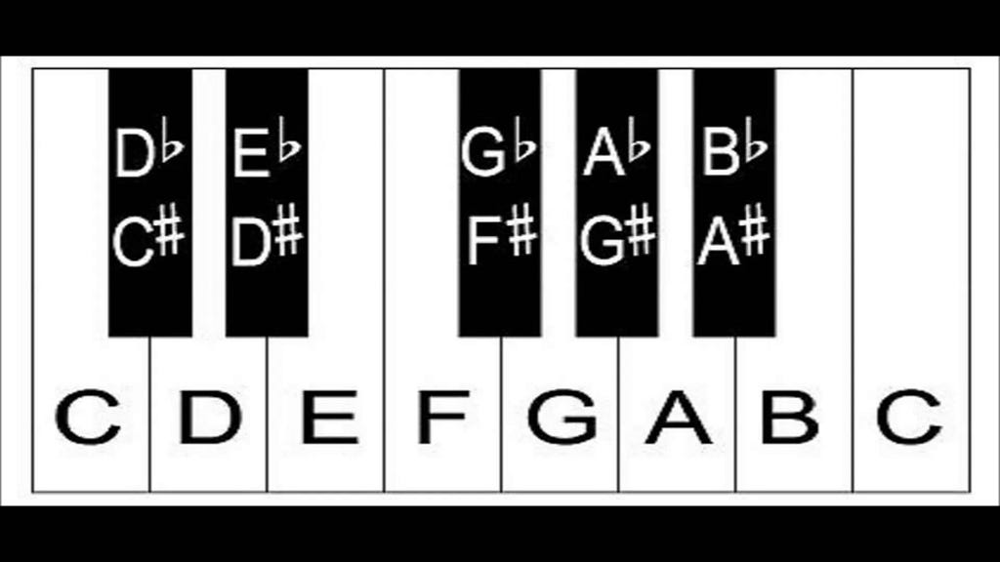

Quando não estou diante de uma “sopa de letras coloridas” (as pessoas dizem isso quando veem minha tela no VS Code) ou de um “texto verde pulando” (sim, essa é para o terminal), eu gosto de tocar e estudar música! Mergulhando na minha jornada com F#, esta é a minha tentativa de misturar essa paixão nova com a antiga.

#### Um contexto básico de música

Como você talvez já saiba, música tem muitas maneiras de fazer as coisas: campos harmônicos, progressão de acordes, escalas e muito mais. Mas vamos manter isso simples; todo mundo conhece pelo menos uma escala, a escala maior:

<a href="https://medium.com/media/76b2839cb71b2a56dc2f609904087fb9/href">https://medium.com/media/76b2839cb71b2a56dc2f609904087fb9/href</a>

Esta, em particular, é a escala de C maior: **C D E F G A B C**. É uma escala comum porque não tem nenhum acidente: **bemóis (♭)** ou **sustenidos (♯)**. Uma boa maneira de ver isso é usando como referência as teclas brancas e pretas de um teclado de piano:



12 notas para a escala [cromática](https://en.wikipedia.org/wiki/Chromatic_scale) completa. É aqui que F# a linguagem e a nota se misturam. O mesmo vale para C#.

### Falar é fácil. Mostre-me o código

Adoro essa citação do Linus. Vamos modelar nosso domínio, primeiro as notas:

<a href="https://medium.com/media/f0e914fc9280cce00f465c3dd78203c3/href">https://medium.com/media/f0e914fc9280cce00f465c3dd78203c3/href</a>

O intervalo de uma nota chamado **semitom** (meio passo ou meio tom) é o menor intervalo musical usado com frequência. Podemos fazer nossas notas interagirem entre si modelando o seguinte padrão:

<a href="https://medium.com/media/499d9ff28024a185995c92e001997993/href">https://medium.com/media/499d9ff28024a185995c92e001997993/href</a>

Fácil, certo? Quando um C é dado, subir meio tom resulta em Db ou C#. Pitch aqui é apenas: note -> note.

Como você imaginou, é possível modelar um **tom inteiro** subindo dois semitons:

<a href="https://medium.com/media/880a9780d279b671f5391ebe308e5e59/href">https://medium.com/media/880a9780d279b671f5391ebe308e5e59/href</a>

Estamos prontos para modelar nossa primeira escala, uma escala maior. A escala maior é uma escala diatônica; isso basicamente significa que ela é composta por 5 tons e 2 semitons. Na escala maior eles são distribuídos na seguinte ordem:

Tom — Tom — Semitom — Tom — Tom — Tom — Semitom

É por isso que a escala de C maior é C D E F G A B C, porque de C para D é um tom, de D para E é um tom, de E para F é um semitom, de F para G é um tom e assim por diante...

**Como podemos modelar isso em F# (a linguagem)?**

<a href="https://medium.com/media/df5e77c4e9b904a4b6da733b38f3fdbc/href">https://medium.com/media/df5e77c4e9b904a4b6da733b38f3fdbc/href</a>

Aí vem um exercício de Programação Funcional: como podemos construir Notes a partir dos nossos Pitches e da escala maior?

Podemos aplicar um fold na lista Major aplicando o Pitch atual na última nota da escala, partindo de uma nota inicial que é a nossa [**tônica**](https://en.wikipedia.org/wiki/Tonic_(music)):

<a href="https://medium.com/media/b6ae6a9858569fef9726f136d25b7cd4/href">https://medium.com/media/b6ae6a9858569fef9726f136d25b7cd4/href</a>

```
λ dotnet run
[C; D; E; F; G; A; B; C]
```

Vamos tentar outra tônica, uma com acidentes (♭/♯): que tal a **escala maior de F# (a nota)?** [https://en.wikipedia.org/wiki/F-sharp\_major](https://en.wikipedia.org/wiki/F-sharp_major) (F♯, G♯, A♯, B, C♯, D♯ e E♯). Isso pode ser um pouco confuso, mas lembre-se: F# é Gb, G# é Ab etc. [E# também é enarmônico de F](https://en.wikipedia.org/wiki/F_(musical_note)#E_sharp). Aqui está o Program.fs completo:

<a href="https://medium.com/media/22ac05b351ed3b2cf40ee16bd4f301d7/href">https://medium.com/media/22ac05b351ed3b2cf40ee16bd4f301d7/href</a>

```
λ dotnet run
[Gb; Ab; Bb; B; Db; Eb; F; Gb]
```

### Adicionando mais contexto musical

Cada nota na escala tem seu próprio significado e desempenha papéis diferentes na harmonização. Como a primeira nota é a tônica, a segunda é a supertônica, a terceira é a [mediante](https://en.wikipedia.org/wiki/Mediant) e assim por diante... Elas costumam ser representadas por algarismos romanos:

<a href="https://medium.com/media/f3b93d503190ba2c6a5fa02b464decdb/href">https://medium.com/media/f3b93d503190ba2c6a5fa02b464decdb/href</a>

Agora devemos incrementar nossa função build para trazer essa nova semântica para a nossa escala:

<a href="https://medium.com/media/b15827ed3980c4e989443b39ed5d3853/href">https://medium.com/media/b15827ed3980c4e989443b39ed5d3853/href</a>

Para simplificar, voltamos à nossa clássica escala de C maior, mas agora com contexto de tríade:

```
λ dotnet run
[I C; II D; III E; IV F; V G; VI A; VII B; I C]
```

### Acordes!

Um acorde acontece quando 3 ou mais notas são tocadas simultaneamente.

<a href="https://medium.com/media/cb87f7e00cbc57031cd6b6052953678d/href">https://medium.com/media/cb87f7e00cbc57031cd6b6052953678d/href</a>

Elas não são selecionadas aleatoriamente. Para soar bem, o acorde maior é formado escolhendo alguns graus na escala maior; são eles:

I — Tônica

III — Mediante

V — Dominante

<a href="https://medium.com/media/3c3366cf736cdd4e4f9a252e432270f4/href">https://medium.com/media/3c3366cf736cdd4e4f9a252e432270f4/href</a>

Então o acorde de C maior é formado por: **C** _D_ **E** _F_ **G** _A B_


Vamos conferir:

<a href="https://medium.com/media/4afd92252101054938fd99a6e6362ff3/href">https://medium.com/media/4afd92252101054938fd99a6e6362ff3/href</a>

```
λ dotnet run
[I C; II D; III E; IV F; V G; VI A; VII B; I C]
[C; E; G]
```

Sim, você quer saber o acorde de **F# (a nota)**, certo? Vamos usar **F# (a linguagem)**:

<a href="https://medium.com/media/f811859fc83007f9d4c05cf15056c93d/href">https://medium.com/media/f811859fc83007f9d4c05cf15056c93d/href</a>

```
λ dotnet run
[I Gb; II Ab; III Bb; IV B; V Db; VI Eb; VII F; I Gb]
[Gb; Bb; Db]
```


Lembre-se: F# = Gb; A# = Bb; C# = Db.

Essa é toda a diversão por enquanto. Você pode acompanhar o trabalho em andamento aqui: [https://github.com/leocavalcante/Fusic](https://github.com/leocavalcante/Fusic)

Obrigado!
