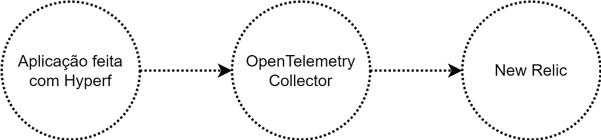

At PicPay, to improve the scalability of our PHP applications, we use _Swoole_ as a high-performance _runtime_, making applications asynchronous and non-blocking.

Starting to use _Swoole_ brought some challenges, and one of them is observability. We will understand more about it later.

Photo by [Davyn Ben](https://unsplash.com/@davynben) on [Unsplash](https://unsplash.com)

### Observability

Observability is the methodology that the microservices and _cloud-native_ market uses to monitor applications, understand how resources are being used, determine whether the application is delivering what it is supposed to do, and, if there are errors, identify them.

To do that, three pillars are defined (and maybe a fourth):

#### Metrics

Metrics are quantitative evaluation measurements commonly used to compare and track performance or output. **How many times it happened.**

#### Traces

A set of _Spans_; they are the collection of places through which the life cycle of a transaction passed. **Where it happened.**

#### Logs

Information about the current context at the moment something happened during the life cycle of a transaction. **What happened.**

#### **Events?**

It is increasingly common to separate _logs_ from events, and many people see them as the fourth pillar of observability. Events are information about business rules. Custom data about the experience of a given data flow. The biggest difference from _logs_ is that infrastructure data does not live here.

### Hyperf

_Hyperf_ is the _web framework_ we adopted for PHP applications on _Swoole_. The points that led us to use it were that it has coroutines as first-class citizens. _Hyperf_ was made for _Swoole_; it was not adapted for _Swoole_ as would be the case with other market _frameworks_ such as _Laravel_, _Symfony_, and _Laminas_.

All of its components are prepared to work with coroutines using connection _pools_, avoiding global state by using coroutine contexts, and avoiding _memory leaks_ as much as possible, since process memory will no longer be cleared on every request. With that also comes the care needed to prevent data from one request from affecting another.

In short, _Hyperf_ is prepared to work in a _stateful_ way, which is the complete opposite of the stateless model of traditional PHP-FPM.

#### Made for microservices

Another very nice point that supported our choice is the way _Hyperf_ focuses on microservices. It does not worry about things like _views_ and sessions, which are more commonly used when building websites.

Instead, Hyperf delivers components designed for microservices and the _cloud_ world, things like _circuit-break_, _rate-limit_, _service-discovery_, _remote-config_, gRPC, etc.

**And, of course, alongside these _cloud-native_ components focused on microservices, there are also components for Observability.**

#### Problems with APMs

Application observability is usually done trivially through APMs. The monitoring service provider, for example _New Relic_, provides an APM that can be added to the server to run alongside the application, and it instruments what is happening.

APMs do this using a technique called _Monkey Patch_, a way of adding behavior at runtime. When you call cURL through the curl\_ functions, for example, you are actually calling the _New Relic_ library, which in turn calls PHP's standard cURL, but in the middle of that it adds the behavior that performs the instrumentation.

Swoole has a _feature_ called _Runtime Hooks_, which makes current PHP resources such as cURL, PDO, Redis, etc. work asynchronously inside its _event loop_. _Swoole_ does this using the same _Monkey Patch_ technique, overriding PHP's native functions to add this new behavior.

Then comes the problem: two extensions, each wanting to apply a _monkey patch_, overriding the same native PHP functions. They conflict, and in the end neither works.

### OpenTelemetry

One of the ways we found to solve this problem with APMs was to do the instrumentation using PHP itself instead of APMs. It worked really well. Fortunately, _New Relic_ has a REST API, actually REST APIs that map exactly 1:1 to the pillars: one API for metrics, one for traces, and one for events. We instrumented things manually and sent the data to those APIs.

The problem with that is that there was too much mixing between business rule code and instrumentation code; classes and methods gained more lines of things that were not directly related.

In any case, it was through this idea of instrumenting with PHP that we discovered **OpenTelemetry**.

The _OTel_ project is the merger of the _OpenTracing_ and _OpenCencus_ projects; in other words, initiatives for Observability using open formats already existed. _OpenTelemetry_ brought these people together into a foundation and organization.

There were already _OpenTracing_ projects for PHP that generated open formats such as _Jaeger_ and _StatsD_, and these projects were inherited by _OpenTelemetry_. This was the missing piece needed to connect the observability ecosystem, which already worked very well, to _OpenTelemetry_ through its _Collector_ component; it was the piece that connected these open formats with _New Relic_.

Remember that _Hyperf_ is entirely focused on microservices, including Observability? So it already provides two components called hyperf/trace and hyperf/metric that serve precisely to instrument _Hyperf_ applications and export them to open formats.

#### Instrumentation with AOP

A very nice point about instrumentation, to avoid the problem of having it mixed with business rules and code that does other things, is that _Hyperf_ uses a technique called AOP, from _Aspect Oriented Programming_. It is a way to implement _Monkey Patch_ (remember it?), meaning we can add behavior (in this case, instrumentation) to classes, methods, and functions without actually changing their code.

But this time, this _monkey patch_ made with AOP provided by _Hyperf_ is done with PHP itself, so we do not have the conflict problem with the _monkey patch_ done by _Swoole_ to make PHP components non-blocking.

I highly recommend reading about the technique: [https://en.wikipedia.org/wiki/Aspect-oriented\_programming](https://en.wikipedia.org/wiki/Aspect-oriented_programming)

### Conclusion

#### Application built with Hyperf

It is instrumented and exports data in open formats, such as _Jaeger_ and _StatsD_.

#### OpenTelemetry Collector

Because it is the combination of _OpenTracing_ and _OpenCensus_, it inherits the ability to receive open formats (such as _Jaeger_ and _Statsd_) and has support from _New Relic_ itself to export the data to its platform.

#### New Relic

A strong partner of the project, supporting the initiative and increasingly adding support to receive the data generated by _OpenTelemetry_ components.
