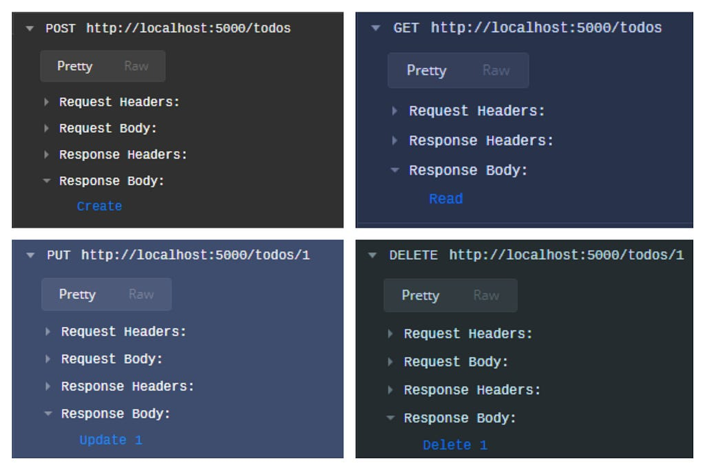
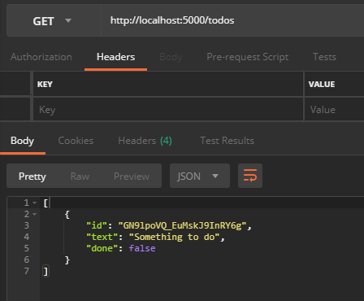

I have just a couple years in functional programming, just a couple weeks in F# and no background or experience with .NET, so don’t take this as a reference from an expert, it’s just me documenting what I’ve learned so far.

You can start by building a very raw-vanilla-bare-bones HTTP server using the [HttpListener from .NET](https://docs.microsoft.com/en-us/dotnet/framework/network-programming/httplistener), **but is very low-level** in terms of having few abstractions, like: you have to write on stream buffers to output something.

There is [ASP.NET Core](https://docs.microsoft.com/en-us/aspnet/core/?view=aspnetcore-2.1), **but is is very object-oriented**, it’s constructions aren’t functional and hey, we’re using F# for a reason, right?

[Freya](https://freya.io/) seams to be an awesome purely functional high-level way to go, **but few maintainers and months without updates**.

### Introducing Giraffe

Then there is [Giraffe](https://github.com/giraffe-fsharp/Giraffe), the survival of my biased criteria above, it’s **high-level, functional-first and actively maintained!**

You can start by using it’s dotnet-new template, but I like a greenfield so let’s get started from scratch:

```
λ mkdir Todos
λ cd Todos
λ dotnet new console -lang F#
```

We’re starting using the _console_ template, it’s the simplest I’ve found, it will put just a minimal **.fsproj** file. You can run it to make sure everything is fine:

```
λ dotnet run
Hello World from F#!
```

Let’s add our dependencies. Giraffe runs on top of ASP.NET Core and we’ll be using the C#’s MongoDB driver, but don’t worry, [it’s awesome for F# too](https://www.mongodb.com/blog/post/enhancing-the-f-developer-experience-with-mongodb).

```
λ dotnet add package Microsoft.AspNetCore.App
λ dotnet add package Giraffe
λ dotnet add package MongoDB.Driver
```

Their are all coming from [NuGet](https://www.nuget.org/).

Let’s change our Hello World to print on a Request:

<a href="https://medium.com/media/e6a59730ffedd833766403662e26b48a/href">https://medium.com/media/e6a59730ffedd833766403662e26b48a/href</a>

To start our development server:

```
λ dotnet run
```

You’ll see a message telling you that it’s running on [http://localhost:5000](http://localhost:5000) head over to this URL on your favorite web browser and you should be seeing: Hello World from F#!

**We have a running server!** Now what?

#### We’re going to make this simple

Todos have a text telling what to-do and a boolean flag telling if it’s already done, despite a unique identifier, of course:

<a href="https://medium.com/media/1339f5ea09bdbf38a364793aa97cabda/href">https://medium.com/media/1339f5ea09bdbf38a364793aa97cabda/href</a>

#### Framing our CRUD endpoints

Despite serving “Hello World” texts, of couse, Giraffe can delegate HTTP endpoints to function [handlers](https://github.com/giraffe-fsharp/Giraffe/blob/master/DOCUMENTATION.md) defined as HttpFunc -> HttpContext -> HttpFuncResult:

<a href="https://medium.com/media/c145fc38df06d4a6319379652e141522/href">https://medium.com/media/c145fc38df06d4a6319379652e141522/href</a>

We also need to update our Program.fs to include this handlers to our routes:

<a href="https://medium.com/media/d056bbc1cf929e59ac1cb180a3bfa545/href">https://medium.com/media/d056bbc1cf929e59ac1cb180a3bfa545/href</a>

Start the server with dotnet run and try it!



#### InMemory Todos

Before we put our hands on MongoDB, we could make a proof-of-concept using and very simple in-memory representation of what would be a Todo repository and how to operate our CRUD functions on it.

Also, it’s a way to make sure our domain isn’t too tied to any database vendor, we could replace MongoDB by any other type of storage just by re-implementing the function signatures to the new database.

Augment the Todo.fs with the following types:

<a href="https://medium.com/media/42773368c07c9ffafaa9ddd88cc06c2c/href">https://medium.com/media/42773368c07c9ffafaa9ddd88cc06c2c/href</a>

It isn’t doing so much, but think on this like OO interfaces. The big deal here is that we’re not going to reinvent the wheel and instead use the awesome [Dependency Injection constructs that ASP.NET Core already provides](https://docs.microsoft.com/en-us/aspnet/core/fundamentals/dependency-injection?view=aspnetcore-2.1).

For example, our HTTP GET endpoint will look like:

<a href="https://medium.com/media/8976e68359a0ad47ff35dc4cc9525915/href">https://medium.com/media/8976e68359a0ad47ff35dc4cc9525915/href</a>

We’re relying on the TodoFind “interface” and for the endpoint, the implementation doesn’t matter, it could be in-memory, MongoDB or any other, it only knows that it receives a TodoCriteria and returns a Todo\[\] (which then Giraffe auto-magically parses to JSON through thejson function).

**Yes, we’re doing Dependency Inversion with Functions!**


Functional Programming Design Patterns by Scott Wlaschin

Let’s implement the C and R parts of the CRUD in-memory with the help of a Hashtable:

<a href="https://medium.com/media/6dadd91e032a29e7c7848cc40a524f75/href">https://medium.com/media/6dadd91e032a29e7c7848cc40a524f75/href</a>

You probably noticed that find here is slight different from TodoFind it is Hashtable -> TodoCriteria -> Todo\[\]. That is because we need to share the same Hashtable along with other functions, but no worry and thanks to Currying we can give a Hashtable to find and it returns a perfect fine TodoFind. We can inject it like a Singleton through configureServices:

<a href="https://medium.com/media/3e521b7fa8f6e38cbcf27a8070c15cc9/href">https://medium.com/media/3e521b7fa8f6e38cbcf27a8070c15cc9/href</a>

You got it, right? We are defining our TodoFind with the **“hashtabled”** find function from TodoInMemory. Let’s implement the TodoSave:

<a href="https://medium.com/media/49bc96ab52619921db12c2b7ee9800ef/href">https://medium.com/media/49bc96ab52619921db12c2b7ee9800ef/href</a>

Then let’s inject it to our services, but don’t forget we have to share the Hashtable so we’ll be finding and saving on the save place in-memory:

<a href="https://medium.com/media/8096ebb7e019a0cb295ab9dd38ebf1b5/href">https://medium.com/media/8096ebb7e019a0cb295ab9dd38ebf1b5/href</a>

We can make things better here. Note that IServiceCollection got an AddGiraffe method? No, Giraffe isn’t built-in on .NET, it used the power of [Type Extensions](https://docs.microsoft.com/en-us/dotnet/fsharp/language-reference/type-extensions) and we can do this to for TodoInMemory:

<a href="https://medium.com/media/acbf15c323788a4ff9ad7101fe78c7b8/href">https://medium.com/media/acbf15c323788a4ff9ad7101fe78c7b8/href</a>

We aren’t avoiding a call to AddSingleton to every function signature, but at least it’s well placed on the same module, is very clear and easy to reason about. We can use AddTodoInMemory just like AddGiraffe:

<a href="https://medium.com/media/5e2383b863f86f48447de6eb89eac402/href">https://medium.com/media/5e2383b863f86f48447de6eb89eac402/href</a>

Now we should update TodoHttp to retrieve and call our functions, we already saw how GET looks like, here is the full file with the POST modification:

<a href="https://medium.com/media/1dacf69e886a9bb717aa1e989896771e/href">https://medium.com/media/1dacf69e886a9bb717aa1e989896771e/href</a>

**We’re already able to save and find some Todos!**




Remember, it’s all in-memory on that mutable Hashtable, if we restart the server everything is gone.

### Implementing MongoDB!

First our final type TodoDelete for Delete, we’re going to use TodoSave for Create and Update:

<a href="https://medium.com/media/5c823761845dabbc6f93618379482ae9/href">https://medium.com/media/5c823761845dabbc6f93618379482ae9/href</a>

Not much difference from in-memory, we going to replace the Hashtable by a IMongoCollection and refactor our save to know when to insert or update, also implement TodoDelete:

<a href="https://medium.com/media/c51dd438bd7181f8a3aec8f9f5afe793/href">https://medium.com/media/c51dd438bd7181f8a3aec8f9f5afe793/href</a>

And, as expected, TodoHttp has no changes to Create and Read, let’s just implement Update and Delete:

<a href="https://medium.com/media/225ae8cf65ed20cc6cd38225338c596a/href">https://medium.com/media/225ae8cf65ed20cc6cd38225338c596a/href</a>

And we replace services, from AddTodoInMemory to AddTodoMongoDb. Of course, we’ll need a MongoDB client connection and a MongoDB database:

<a href="https://medium.com/media/77d49aaa247cb4b0c669a3ddfabc2ab1/href">https://medium.com/media/77d49aaa247cb4b0c669a3ddfabc2ab1/href</a>

I’m assuming you have a running MongoDB server somewhere and we’re getting the connection string from the environment variables, so before you dotnet run make sure o have this variables or set/export one. In my case I have MongoDB on localhost, so: export MONGO\_URL=mongodb://localhost:27017/.

**That is it!** We have a functional-first, decoupled HTTP Rest API with F# and MongoDB. As said before, I’m new to all of this, so I’d love to hear some feedback from experienced folks and if this is new to you too, don’t mind to comment your questions, let’s figure it out together.

#### Thanks!
